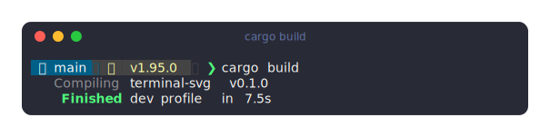
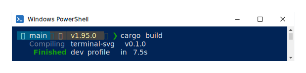
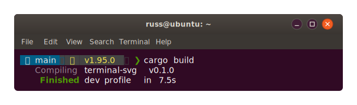
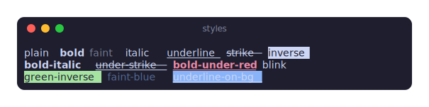
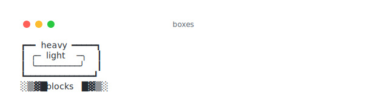

# terminal-svg

Pixel-perfect SVG screenshots of terminal output, from a single self-contained binary.



Point it at a command, a file, or a pipe and it produces an SVG with window
chrome (macOS, Windows 11, or Ubuntu style), your favourite colour scheme, and — the part that makes it
"perfect" — a **subsetted JetBrains Mono Nerd Font embedded in the SVG itself**,
so it renders identically everywhere: GitHub READMEs, blog posts, browsers on
machines with no fonts installed. The image above is terminal-svg's own output.

## Why another one?

Tools in this space usually either regex-strip ANSI codes (breaking progress
bars and cursor movement) or reference system fonts (breaking alignment on
every machine that doesn't have the font). terminal-svg does neither:

- **Real terminal emulation** — output is fed through a proper VT state
  machine ([avt](https://github.com/asciinema/avt), the engine behind
  asciinema). Carriage-return progress bars, `ESC[K` clears, and cursor-up
  repaints all resolve to exactly the final screen a real terminal would show.
- **Per-screenshot font subsetting** — only the glyphs actually used are
  embedded (as WOFF2), typically adding just a few KB. Box-drawing characters
  align seamlessly, Nerd Font powerline segments just work, and wide CJK
  characters occupy exactly two cells.
- **Emoji stay emoji** — colour emoji can't live in a monochrome font subset,
  so they're emitted as their own explicitly-positioned text runs and render
  through the viewer's native emoji font without knocking later columns out
  of alignment.

## Usage

```sh
# Run a command in a PTY (it sees a real TTY, so colours are on)
terminal-svg -- lsd -la
terminal-svg --title "tests" -o tests.svg -- cargo test

# Pipe ANSI output through it
ls --color=always | terminal-svg -o ls.svg

# Render a captured ANSI dump
terminal-svg dump.ansi -t nord -o dump.svg
```

## Recording animated SVGs

`terminal-svg rec` drops you into your shell, records everything, and renders
an **animated SVG** replaying the session when you exit — a GIF-quality demo
at a fraction of the size, with real selectable text, that plays anywhere an
`` tag does (GitHub READMEs included, no JavaScript).



*The image above is a 42 KB animated SVG ([docs/assets/demo.cast](docs/assets/demo.cast)
rendered by terminal-svg itself) — typing, a spinner, and a carriage-return
progress bar all replayed from real timing data, with the font embedded.*

```sh
# Record an interactive session ($SHELL); exit the shell to finish
terminal-svg rec -o demo.svg

# Record a single command instead of a shell
terminal-svg rec -o build.svg -- cargo build

# Tweak the replay without re-recording: rec keeps an asciicast next to
# the SVG (demo.cast above), and .cast files render directly
terminal-svg demo.cast -t github-dark -o demo-dark.svg
terminal-svg demo.cast --speed 2 --no-loop -o demo-fast.svg
```

Recordings are standard [asciicast v2](https://docs.asciinema.org/manual/asciicast/v2/)
files — `asciinema play demo.cast` works, and existing asciinema recordings
(v2 or v3, so anything asciinema 3 records) render with plain
`terminal-svg session.cast`; `-t auto` renders a v3 cast with the palette
of the terminal it was recorded in. Long pauses are capped at 2s
(`--idle-time-limit`), bursts are coalesced to ≤30fps, identical frames are
deduplicated, and repeated rows are shared across frames via `<defs>`/`<use>`,
so even minute-long sessions stay compact. The animation loops with a 1.5s
hold on the last frame; `--no-loop` plays once and freezes, and `--static`
renders just the final screen. Viewers with `prefers-reduced-motion` set
see the final frame as a still poster instead of the animation, and
`--cursor` picks the cursor shape (`block`, `bar`, `underline`, `none`).

### Options

The highlights below; every flag, with behaviour notes and recipes, is in
the [CLI reference](docs/usage.md).

| Flag | Default | |
|---|---|---|
| `-o, --output` | `terminal.svg` | `-` writes to stdout |
| `-t, --theme` | `dracula` | built-in name or path to a `.toml` |
| `--theme-light` / `--theme-dark` | | dual-theme SVG switched by `prefers-color-scheme`, static or animated |
| `--chrome` | `macos` | window style: `macos`, `windows`, `ubuntu`, `none` |
| `--title` | auto | falls back to the title the program set (OSC 0/2), then the command string |
| `--title-emoji` | 📁 for paths | emoji before the title; `""` disables |
| `-c, --cols` / `-r, --rows` | 80 × 24 | PTY size; image height follows content |
| `--font-size` / `--line-height` | 14 / 1.2 | chrome is fixed-size and doesn't scale with the font |
| `--padding` / `--margin` | 10 / 24 | margin is 0 with `--no-shadow` |
| `--no-window` | | bare rounded panel, no chrome (alias for `--chrome none`) |
| `--no-background` | | transparent: no window body, chrome, or shadow |
| `--no-shadow` | | |
| `--no-font-embed` | | reference system fonts instead |
| `--timeout <secs>` | | kill the PTY command after N seconds |
| `--list-themes` | | |

Titles are auto-detected: `--title` wins, then the recording's own title,
then the last directory the shell reported via OSC 0/2 (shown Ghostty-style
as `📁 ~/Code/blog`), then the command string.

```sh
# GitHub README demo that follows the viewer's light/dark mode — works
# animated or with --static, at barely any size cost over one theme
terminal-svg demo.cast --theme-light github-light --theme-dark github-dark

# Faithful Windows PowerShell and Ubuntu GNOME Terminal windows
terminal-svg --chrome windows -t powershell -- pwsh -c 'Get-ChildItem'
terminal-svg --chrome ubuntu -t ubuntu -- lsd -la
```




Animation options (for `rec` and `.cast` input):

| Flag | Default | |
|---|---|---|
| `--idle-time-limit <secs>` | 2 | cap pauses between events |
| `--speed <n>` | 1 | playback speed multiplier |
| `--no-loop` | | play once and hold the last frame |
| `--static` | | render only the final screen |
| `--at <secs>` | | render the screen at this point in the recording (implies `--static`) |
| `--cast <path>` | output stem + `.cast` | where `rec` saves the recording |
| `-c` / `-r` (rec) | current terminal size | recorded PTY size |

### Themes

`dracula` (default), `catppuccin-mocha`, `nord`, `tokyo-night`, `github-dark`,
`github-light`, `solarized-dark`, plus `powershell` (the classic conhost navy
with the Campbell palette) and `ubuntu` (aubergine + Tango) to pair with the
matching chrome styles.




Custom themes are a small TOML file (16 ANSI colours + foreground/background,
optional chrome overrides) — see the [theme format reference](docs/themes.md):

```sh
terminal-svg -t my-theme.toml -- htop
```

## Installing

It's a single self-contained binary — no runtime dependencies. The full
walkthrough (checksums, PATH setup, ARM builds) is in the
[installation guide](docs/install.md); the short version:

**Homebrew** (macOS and Linux):

```sh
brew install russmckendrick/tap/terminal-svg
```

**Prebuilt binaries** — every [release](https://github.com/russmckendrick/terminal-svg/releases)
ships binaries with stable names, so `releases/latest/download/` always
grabs the newest:

```sh
# Linux (swap amd64 for arm64 on ARM)
curl -LO https://github.com/russmckendrick/terminal-svg/releases/latest/download/terminal-svg-linux-amd64
chmod +x terminal-svg-linux-amd64 && sudo mv terminal-svg-linux-amd64 /usr/local/bin/terminal-svg

# macOS (darwin-arm64 for Apple Silicon, darwin-amd64 for Intel)
curl -LO https://github.com/russmckendrick/terminal-svg/releases/latest/download/terminal-svg-darwin-arm64
chmod +x terminal-svg-darwin-arm64 && sudo mv terminal-svg-darwin-arm64 /usr/local/bin/terminal-svg
```

On Windows, download
[terminal-svg-windows-amd64.exe](https://github.com/russmckendrick/terminal-svg/releases/latest/download/terminal-svg-windows-amd64.exe),
rename it `terminal-svg.exe`, and put it somewhere on your `PATH` —
[step-by-step PowerShell instructions](docs/install.md#windows) in the guide.
Every binary has a `.sha256` next to it on the release page if you want to
[verify the download](docs/install.md#verifying-checksums).

**From source** (Rust 1.85+):

```sh
cargo install --git https://github.com/russmckendrick/terminal-svg
```

## Building

```sh
cargo build --release
```

The JetBrainsMono Nerd Font Mono faces in [assets/fonts/](assets/fonts/)
(SIL OFL) are compressed at build time and baked into the binary — no runtime
dependencies, nothing to install.

Development loop:

```sh
cargo test                      # unit + golden + PTY integration tests
UPDATE_GOLDEN=1 cargo test      # refresh golden SVGs after rendering changes
./scripts/gallery.sh            # render all fixtures × themes → gallery.html
```

## How it works

The short version below; the full walkthrough (including the two
renderer-compatibility rules that keep columns aligned everywhere) is in
[docs/architecture.md](docs/architecture.md).

1. **Capture** — spawn the command in a pseudo-terminal
   ([portable-pty](https://crates.io/crates/portable-pty)) or read bytes from
   stdin/file.
2. **Interpret** — feed everything through avt; read back the final grid
   (scrollback + screen), resolve inverse/faint/palette colours, and merge
   adjacent same-style cells into runs.
3. **Render** — lay the grid out with metrics read from the actual bundled
   font (ttf-parser), draw background rects, text runs, and decoration lines
   (CSS `text-decoration` is unreliable across SVG renderers, so underlines
   are real `<line>` elements), wrap it in window chrome.
4. **Embed** — collect the glyphs used per weight, subset with
   [allsorts](https://crates.io/crates/allsorts) (keeping a Unicode cmap —
   browsers reject fonts without one), encode to WOFF2
   ([ttf2woff2](https://crates.io/crates/ttf2woff2), pure Rust), and inline
   as a base64 `@font-face`.

## Documentation

- [Installation guide](docs/install.md) — Homebrew, release binaries for
  macOS/Linux/Windows, checksum verification, building from source
- [CLI reference](docs/usage.md) — every flag, the `rec` subcommand, and
  recipes
- [Themes](docs/themes.md) — the built-ins and the custom TOML format
- [Architecture](docs/architecture.md) — the full pipeline walkthrough
- [Scripts](scripts/README.md) — the development helpers in [scripts/](scripts/)
- [terminal-svg.dev](https://terminal-svg.dev) — theme gallery, built from
  [site/](site/)

## License

MIT. Bundled fonts are licensed under the SIL Open Font License —
see [assets/fonts/OFL.txt](assets/fonts/OFL.txt).
